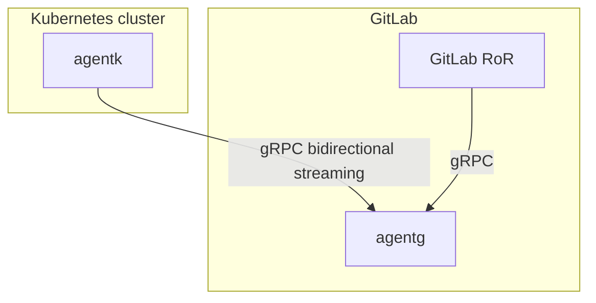

# gitlab-agent

GitLab Kubernetes Agent idea.

1. `agentk` is our agent. It keeps a connection established to a GitLab instance. It waits for requests from it to process.

1. `agentg` is what accepts requests from `agentk`. It also listens for requests from `GitLab RoR`. The job of `agentg` is to match incoming requests from `GitLab RoR` with existing connections from `agentk`, forward the request to it and forward responses back.

1. `GitLab RoR` is the main GitLab application. It uses gRPC to talk to `agentg`. We could also support Kubernetes API to simplify migration of existing code onto this architecture.

[Bidirectional streaming](https://grpc.io/docs/guides/concepts/#bidirectional-streaming-rpc) is used between `agentk` and `agentg` to allow forwarding multiple concurrent requests though a single connection. This allows the connection acceptor i.e. gRPC server (`agentg`) to act as a client, sending requests as gRPC replies. Inverting client-server relationship is needed because the connection has to be initiated from the inside of the Kubernetes cluster i.e. from behind the firewall.
