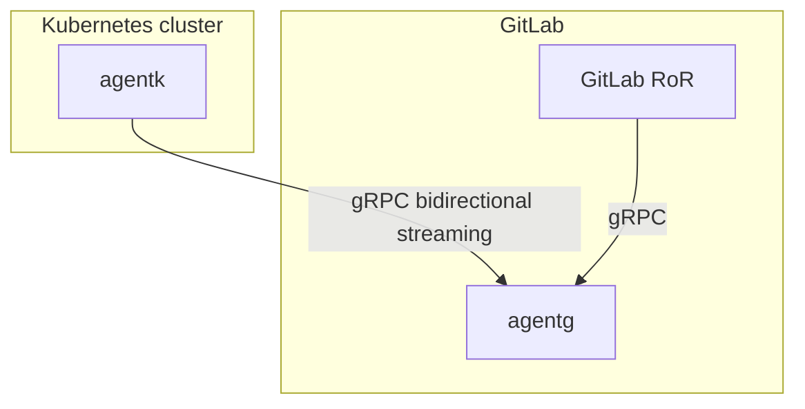

# gitlab-agent

GitLab Kubernetes Agent is an active in-cluster component for solving any GitLab<->Kubernetes integration tasks.

Below are some ideas that can be built using the agent.

* “Real-time” and resilient web hooks. Polling git repos scales poorly and so webhooks were invented. They remove polling, easing the load on infrastructure, and reduce the "event happened->it got noticed in an external system" latency. However, "webhooks" analog cannot work if cluster is behind a firewall. So an agent, runnning in the cluster, can connect to GitLab and receive a message when a change happens. Like web hooks, but the actual connection is initiated from the client, not from the server. Then the agent could:

  * Emulate a webhook inside of the cluster

  * Update a Kubernetes object with a new state. It can be a GitLab-specific object with some concrete schema about a git repository. Then we can have third-parties integrate with us via this object-based API. It can also be some integration-specific object.

* “Real-time” data access. Agent can stream requested data back to GitLab. See https://gitlab.com/gitlab-org/gitlab/-/issues/212810. 

* Feature/component discovery. GitLab may need a third-party component to be installed in a cluster for a particular feature to work. Agent can do that component discovery. E.g. we need Prometheus for metrics and we probably can find it in the cluster (is this a bad example? it illustrates the idea though).

* Better [GitOps](https://www.gitops.tech/) support. A repository can be used as a IaC repo. On successful CI run on the main repo, a commit is merged into that IaC repo. Commit describes the new desired state of infrastructure in a particular cluster (or clusters). An agent in a corresponding cluster(s) picks up the update and applies it to the objects in the cluster. We can work with Argo-cd/Flux here to try to reuse existing code and integrate with the community-built tools.

* “Infrastructure drift detection”. Monitor and alert on unexpected changes in Kubernetes objects that are managed in the IaC repo. Should support various ways to describe infrastructure (kustomize/helm/plain yaml/etc).


* Preview changes to IaC specs against the current state of the corresponding cluster right in the MR.


* “Live diff”. Building on top of the previous feature. In repo browser when a directory with IaC specs is opened, show a live comparison of what is in the repo and what is in the corresponding cluster.


* Kubernetes has audit logs. We could build a page to view them and perhaps correlate with other GitLab events?


* See how we can support https://github.com/kubernetes-sigs/application.

  * In repo browser detect resource specs with the defined annotations and show the relevant meta information bits
  * Have a panel showing live list of installed applications based on the annotations from the specification

* Kubernetes API proxying. Today GitLab cannot integrate with clusters behind a firewall. If we put an agent into such clusters and another agent next to GitLab, we can emulate Kubernetes API and proxy it into the actual cluster via the agents. See the scheme below.

1. `agentk` is our agent. It keeps a connection established to a GitLab instance. It waits for requests from it to process.

1. `agentg` is what accepts requests from `agentk`. It also listens for requests from `GitLab RoR`. The job of `agentg` is to match incoming requests from `GitLab RoR` with existing connections from `agentk`, forward the request to it and forward responses back.

1. `GitLab RoR` is the main GitLab application. It uses gRPC to talk to `agentg`. We could also support Kubernetes API to simplify migration of existing code onto this architecture.

[Bidirectional streaming](https://grpc.io/docs/guides/concepts/#bidirectional-streaming-rpc) is used between `agentk` and `agentg` to allow forwarding multiple concurrent requests though a single connection. This allows the connection acceptor i.e. gRPC server (`agentg`) to act as a client, sending requests as gRPC replies. Inverting client-server relationship is needed because the connection has to be initiated from the inside of the Kubernetes cluster i.e. from behind the firewall.
