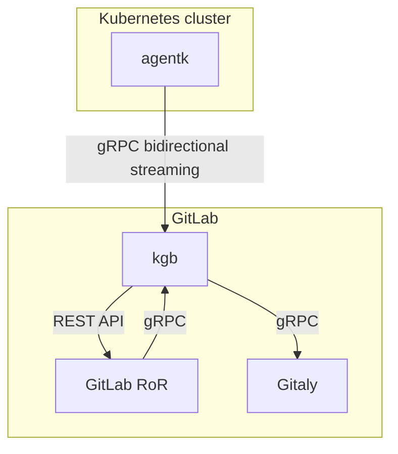

# gitlab-agent architecture

## Issues the agent is trying to address

- In general makes it possible to integrate a cluster behind a firewall or NAT with GitLab. See https://gitlab.com/gitlab-org/gitlab/-/issues/212810.
- Allows for real-time access to API endpoints within a cluster. See https://gitlab.com/gitlab-org/gitlab/-/issues/218220#note_348729266 for an example use case.
- Enables real-time features by pushing information about events happening in a cluster. For example, we could build a cluster view dashboard that visualizes changes happening in a cluster immediately, providing a delightful user experience. We already have some effort happening in this area, see [Real-Time Working Group](https://about.gitlab.com/company/team/structure/working-groups/real-time/).
- Makes it possible to have a cache of Kubernetes objects (via [informers](https://github.com/kubernetes/client-go/blob/ccd5becdffb7fd8006e31341baaaacd14db2dcb7/tools/cache/shared_informer.go#L34-L183)) that is kept up to date with very low latency. Having such a cache would be beneficial to:

  - Reduce/eliminate information propagation latency by avoiding Kubernetes API calls and polling and just fetching data from an automatically up to date cache.
  - Lower the load we put on Kubernetes API by removing polling.
  - Eliminate any rate limiting errors by removing polling.
  - Simplify backend code by replacing polling code with cache access (another API call, but no polling needed).

  For example, https://gitlab.com/gitlab-org/gitlab/-/issues/217792#note_348582537. Instead of fetching data via Kubernetes API we could fetch it from the cache synchronously from the front end.

## High-level architecture

* `agentk` is our agent. It keeps a connection established to a `kgb` instance, waiting for requests to process. It may also actively send information about things happening in the cluster.

* `kgb` stands for Kubernetes-GitLab Broker. It's responsible for:
  * Accepting requests from `agentk`.
  * [Authentication of requests](identity_and_auth.md) from `agentk` by querying `GitLab RoR`.
  * Fetching agent's configuration from a corresponding Git repository by querying Gitaly.
  * Matching incoming requests from `GitLab RoR` with existing connections from the right `agentk`, forwarding requests to it and forwarding responses back.
  * (potentially) Sending notifications via ActionCable for events received from `agentk`.
  * Polling manifest repositories for [GitOps support](gitops.md) by talking to Gitaly.

* `GitLab RoR` is the main GitLab application. It uses gRPC to talk to `kgb`. We could also support Kubernetes API to simplify migration of existing code onto this architecture. Could support both, depending on the need.

[Bidirectional streaming](https://grpc.io/docs/guides/concepts/#bidirectional-streaming-rpc) is used between `agentk` and `kgb`. This allows the connection acceptor i.e. gRPC server `kgb` to act as a client, sending requests as gRPC replies. Inverting client-server relationship is needed because the connection has to be initiated from the inside of the Kubernetes cluster to bypass a firewall or NAT the cluster may be behind. See https://gitlab.com/gitlab-org/gitlab/-/issues/212810.

## Guiding principles

- Prefer putting logic into `kgb` rather than into `agentk`. `agentk` should be kept as simple as possible. On GitLab.com `kgb` is under our control, so we'll be able to upgrade it regularly to add new features without requiring users of the integration to upgrade `agentk` running in their clusters.

  `agentk` still cannot be viewed as a dumb reverse proxy because it will likely have functionality on top of the cache ([via informers](https://github.com/kubernetes/client-go/blob/ccd5becdffb7fd8006e31341baaaacd14db2dcb7/tools/cache/shared_informer.go#L34-L183)).

## FAQ

- **Q**: Why do we need long-running connections? Cannot we just ask users to punch a hole in their firewall?

  **A**: Even if it was always possible, having an agent running in the cluster enables us to build more features, not just connecting such clusters to GitLab.

- **Q**: Why do we need long-running connections? Can we use polling instead?

  **A**: Polling will not allow for real-time access to the in-cluster APIs. For example, our metrics integration queries Prometheus API to get the data for dashboards. I.e. the request comes from GitLab, not from the Kubernetes side.

- **Q**: Can we push data about things happening in the cluster using REST API instead of using streaming?

  **A**: Yes, we could use REST API and push the data. But since we already need long-running connections (see above), why not utilize them? `agentk` uses gRPC which [multiplexes multiple logical channels](https://www.cncf.io/blog/2018/08/31/grpc-on-http-2-engineering-a-robust-high-performance-protocol/) onto a usually smaller number of TCP connections. There will be a smaller number of TCP connections if all communications are consolidated and happen over gRPC. See the link for technical details.

- **Q**: Can we put the cache into `kgb` rather than into `agentk` to make it "dumber" / simpler per the principle above?

  **A**: Technically yes. However, that would mean `kgb` would get an update for each event for object kinds `kgb` runs informers for. An event contains the whole changed object. Number of events in active clusters may be significant. So, multiplied by the number of clusters, that means we'd have a lot of traffic between `kgb` and `agentk`. There is no practical benefit for building it this way, only the downside of having a lot of useless traffic.

  Instead of the above we could have an up to date precomputed view on top of the cache in `kgb`. `agentk` could make the calculations locally and push an update immediately to `kgb` (which could push an event via ActionCable). For example, `agentk` could maintain a cache with [`Node`](https://kubernetes.io/docs/concepts/architecture/nodes/) objects and push the current number of nodes to `kgb` each time there is a change. The UI then can fetch the number of nodes from `kgb` via an API (via the main application or bypassing it).

- **Q**: Why use gRPC for `GitLab RoR` -> `kgb` access? Why not REST API?

  **A**: To benefit from all the [good things gRPC provides or enables](https://grpc.io/faq/) and avoid any pitfalls of a hand-rolled client implementation. GitLab already uses gRPC to talk to Gitaly, it's an existing dependency.

- **Q**: Why use Gitaly directly to fetch data from repositories instead of the usual "front door" (HTTPS or SSH)?

  **A**: There are several reasons:

  - Polling cost is higher for the "front door". For GitLab.com, HTTPS traffic access via the "front door" goes via CloudFlare, HAProxy, and [GitLab Workhorse](https://gitlab.com/gitlab-org/gitlab-workhorse/). For SSH traffic - CloudFlare and GitLab Shell. Only then a request reaches Gitaly. Using the "front door" would mean more traffic for the infrastructure to handle. More load means higher running cost because more hardware/VMs and bandwidth is needed.

  - Accessing Gitaly via gRPC is a better development experience vs invoking Git for repository access. It's essentially the difference between calling a function vs invoking a binary. Better development experience means faster iterations.

  - Putting polling into `kgb` follows the "smart `kgb`, dumb `agentk`" principle described above.

- **Q**: If there is no middlemen between `kgb` and Gitaly, how do we prevent `kgb` overloading Gitaly?

  **A**: `kgb` should rate limit itself. The following not mutually exclusive approaches are possible:

  - Per-`kgb` instance rate limiting can be put in place using gRPC's rate limiting mechanisms.
  - Per-`agentk` rate limiting within `kgb` can be implemented using some external state storage. E.g. [using Redis](https://redislabs.com/redis-best-practices/basic-rate-limiting/). Or, alternatively, each `kgb` instance can enforce per-`agentk` limit just for itself - not as good, but much simpler to implement (no Redis needed).
  - Global rate limiting for all `kgb` instances can also be implemented using Redis.

- **Q**: Should `kgb` be part of GitLab Workhorse?

  **A**: This has been considered.

  Pros:

  - It's built to handle long-running WebSocket connections.
  - It already has access to Redis, GitLab, Gitaly.
  - It's already part of all the installation packages that we provide.

  Cons:

  - Depending on another team(s) for reviews and merging code will likely slow down the development.
  - It may not be a good fit if `kgb` needs to have some significant amount of business logic in it. Mixing unrelated concerns in a single program is not great.

  This has been discussed and the conclusion is:

  - We want to build `kgb` as a separate component.
  - We want to get it deployed to GitLab.com behind a feature flag.
  - We want to experiment with it for a couple of releases, to see how it behaves and what is the cost of running persistent connections to make a better informed decision about next iterations.
  - We can later decide to merge `kgb` into the GitLab Workhorse, or leave it as a separate component.
