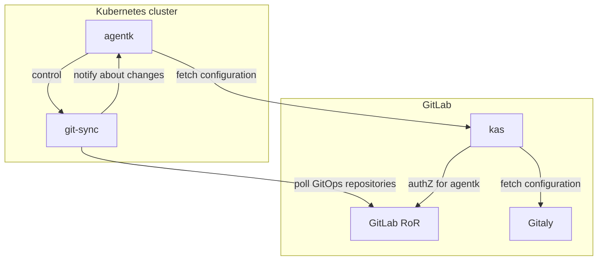
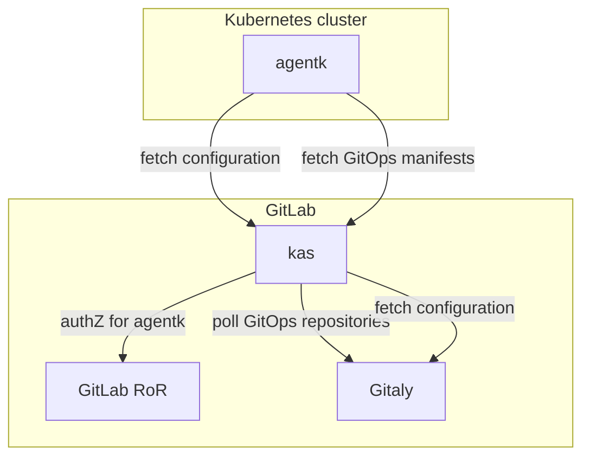

# GitOps support

GitLab Kubernetes Agent offers [GitOps](https://www.gitops.tech/) support. More specifically, the [pull-based version](https://www.gitops.tech/#pull-based-deployments).

## Requirements

- User should be able to have one or more Kubernetes clusters connected to a GitLab project or group.
- User should be able to synchronize cluster-wide state from a Git repository.
- User should be able to synchronize namespace-scoped state from a Git repository.
- User should be able to control:
  - What object kinds an agent can manage
  - Enable namespaced mode of operation (i.e. can manage objects in a particular namespace only)
  - Enable Non-namespaced mode of operation (i.e. can manage objects in any namespace and non-namespaced too)
- User should be able to synchronize state from one or more Git repositories into a cluster.
- User should be able to configure multiple agents running in different clusters to synchronize state from the same repository.

## GitOps architecture - design 1

`agentk` periodically fetches configuration from `kas`. For each configured GitOps repository it spawns a goroutine. Each goroutine spawns a copy of [`git-sync`](https://github.com/kubernetes/git-sync). It polls a particular repository and invokes a corresponding webhook on `agentk` when it changes. When that happens, `agentk` performs a synchronization using [`gitops-engine`](https://github.com/argoproj/gitops-engine).

For repositories no longer in the list, `agentk` stops corresponding goroutines and `git-sync` copies, also deleting their cloned repositories from disk.

## GitOps architecture - design 2 (implemented)

`agentk` periodically fetches configuration from `kas`. For each configured GitOps repository it spawns a goroutine. Each goroutine makes a streaming `GetObjectsToSynchronize()` gRPC call. `kas` accepts these requests and checks with GitLab if this particular agent is authorized to access this repository.
If it is, `kas` starts polling Gitaly for repository updates and sends the latest manifests to the agent. Before each poll, `kas` verifies with GitLab that the agent's token is still valid. When `agentk` receives an updated manifest, it performs a synchronization using [`gitops-engine`](https://github.com/argoproj/gitops-engine).

For repositories no longer in the list, `agentk` stops corresponding `GetObjectsToSynchronize()` calls.

## Design 1 vs design 2

Shared issue: how to grant an agent access to a non-public repository?

Design 1:

- Pro: `agentk` uses `git-sync` to access repositories via the usual ssh+git or HTTPS protocols with usual authentication and authorization methods.
  - Con: User needs to put credentials into a `Secret`. Which credentials? We don't have a mechanism for per-repo tokens for robots, do we?
  - Con: Rotating all credentials is more work vs rotating a single `agentk` token.
- Con: Dependency on `git-sync` - an external component - that can be avoided.
- Con: More network traffic and connections than design 2.

Design 2:

- Pro: Less moving parts as `git-sync` and `git` are not used. This fact makes design 2 more reliable.
- Pro: Existing connectivity and authentication mechanism is used (gRPC + `agentk` token).
- Pro: No polling via external infrastructure. Saves traffic and avoids noise in access logs.

## Alternatives and ideas considered (for design 1)

- Running `git-sync` and `gitops-engine` as part of `kas`.

  - Pro: More code/infrastructure under our control for GitLab.com
  - Con: Running an arbitrary number of `git-sync` processes would require an unbounded amount of RAM and disk space.
  - Con: Not clear which `kas` replica is responsible for which agent/repository synchronization. If done as part of `agentk`, leader election can be done using [client-go](https://pkg.go.dev/k8s.io/client-go/tools/leaderelection?tab=doc).

- Running `git-sync` and a "`gitops-engine` driver" helper program as a separate Kubernetes `Deployment`.

  - Pro: Better isolation and higher resiliency. E.g. if the node with `agentk` dies, not all synchronization is stopped.
  - Pro: Each deployment has its own memory and disk limits.
  - Pro: Per-repository synchronization identity (i.e. distinct `ServiceAccount`) can be implemented vs
  - Con: Time consuming to implement properly:
    - Need to CRUD `Deployment`s and need permissions for that.
    - Users may want to customize `Deployment`s or add/remove satellite objects like `PodDisruptionBudget`, `HorizontalPodAutoscaler`, `PodSecurityPolicy`.
    - Metrics, monitoring, logs for the `Deployment`.

  We may need to do this later.
