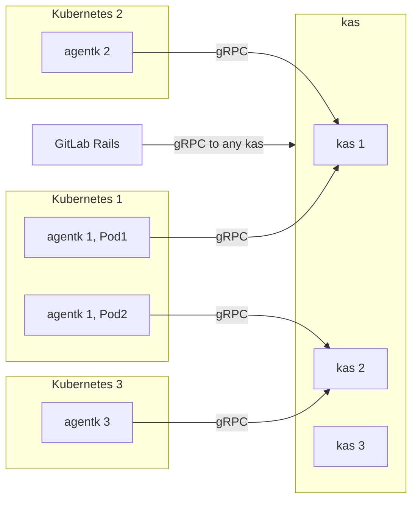
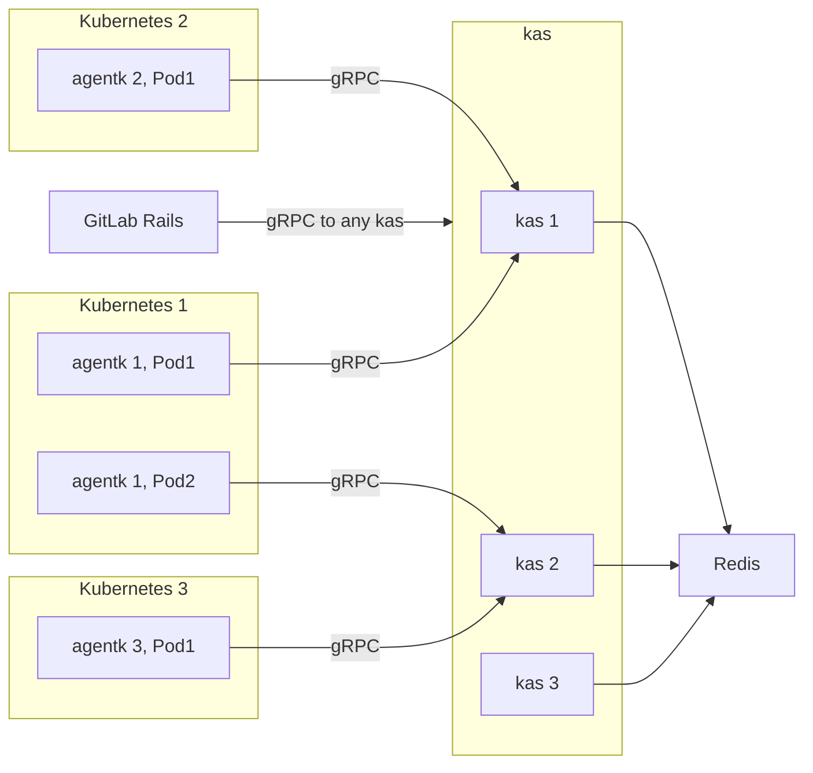
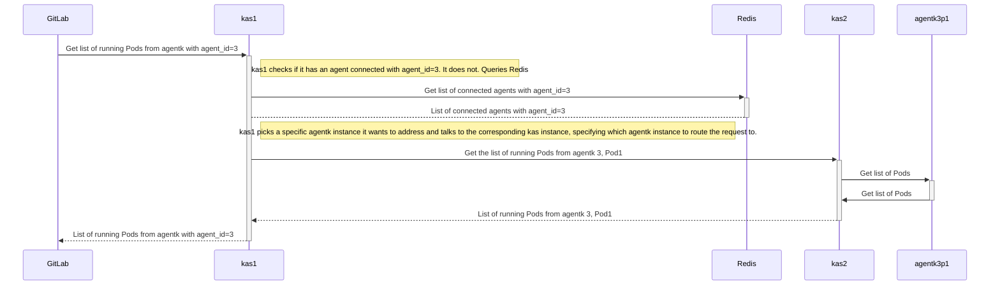

# `kas` request routing

This document describes how `kas` routes requests to concrete `agentk` instances.

## Problem statement

For an architecture overview please see [architecture.md](architecture.md).

GitLab needs to be able to talk to GitLab Kubernetes Agent Server (`kas`) to:

- get information about connected agents.
- interact with agents.
- interact with Kubernetes clusters.

Each agent connects to an instance of `kas` and keeps an open connection. When GitLab needs to talk to a particular agent, a `kas` instance, that this agent is connected to, needs to be found and the request needs to be routed to it.

Here is an architecture diagram that is more detailed and specific for this document.



## Proposed system design



For the above architecture, here is how GitLab would make a request to `agentk1p1`, say, to get the list of Pods.



Each `kas` instance keeps track of agents connected to it in Redis. For each agent it stores a serialized protobuf object with information about the agent. When an agent disconnects, `kas` removes all corresponding information from Redis. For both events `kas` publishes a notification to a [pub-sub channel](https://redis.io/topics/pubsub) in Redis.

Each agent, while logically a single entity, can have multiple replicas (multiple `Pod`s) in a cluster. `kas` needs to accommodate for that and record per-replica (essentially per-connection) information. Each connection is given a unique identified that is used together with agent id to identify a particular `agentk` instance.

gRPC can keep more than one tcp connection open for a single target host. When we say "connection" above, we mean an open `GetConfiguration()` streaming request, not a tcp connection. `agentk` only ever has at most one `GetConfiguration()` streaming request running and that is what `kas` cares about, it does not "see" idle tcp connections as that is handled by the gRPC framework.

Each `kas` instance puts information about itself into Redis so that other `kas` instances can discover and access it.

Each bit of information stored in Redis has an [expiration time](https://redis.io/commands/expire) set, so it expires eventually if the `kas` instance that is responsible for it crashes, etc. To prevent information from expiring too soon, `kas` periodically writes the same information into Redis, updating the expiration time. `kas` cleans up all the information it has put into Redis before it terminates.

When `kas` needs to atomically update multiple data structures in Redis, it uses [transactions](https://redis.io/topics/transactions) to ensure data consistency. Grouped data items must have the same expiration time.

In addition to the existing `agentk` -> `kas` gRPC endpoint, `kas` exposes two new separate gRPC endpoints for GitLab and for `kas` -> `kas` requests. Each endpoint is a separate network listener. This makes it easier to control network access to endpoints and in general allows to have separate configuration for each endpoint.

### GitLab -> `kas` endpoint (external endpoint)

GitLab authenticates with `kas` using JWT. It uses the same shared secret as for the `kas` -> GitLab communication. JWT issuer should be `gitlab` and audience should be `gitlab-kas`.

When accessed via this endpoint `kas` plays the role of request router.

If a request from GitLab comes but there is no agent connected that can handle it, `kas` blocks and waits for a suitable agent to connect to it or to another `kas` instance. It stops waiting when the client disconnects or when some long timeout happens (i.e. client decides how much time it wants to wait). `kas` is notified of new agent connections via a pub-sub channel to avoid frequent polling. When a suitable agent connects, `kas` routes request to it.

### `kas` -> `kas` endpoint (internal endpoint)

This endpoint is an implementation detail, an internal API, and should not be used by any other system. It's protected by JWT using a secret, shared among all `kas` instances. No other system must have access to this secret.

When accessed via this endpoint, `kas` gets the information about the `agentk` it is supposed to send the request to from the request itself. It does not do any discovery, it only does what it's told to do. This prevents any request cycles. Retrying and re-routing requests and all other routing decisions is the responsibility of the `kas` that got the request on the external endpoint, not the `kas` that got it on the internal one. That way there is a single central component (per request) that has the power to decide on how exactly a particular request is routed i.e. this decision is not "distributed" across several `kas` instances.

### API definitions

```proto
syntax = "proto3";

import "google/protobuf/timestamp.proto";

message KasAddress {
    string ip = 1;
    uint32 port = 2;
}

message ConnectedAgentInfo {
    // Agent id.
    int64 id = 1;
    // Identifies a particular agentk->kas connection. Randomly generated when agent connects.
    int64 connection_id = 2;
    string version = 3;
    string commit = 4;
    // Pod namespace.
    string pod_namespace = 5;
    // Pod name.
    string pod_name = 6;
    // When the connection was established.
    google.protobuf.Timestamp connected_at = 7;
    KasAddress kas_address = 8;
    // What else do we need?
}

message KasInstanceInfo {
    string version = 1;
    string commit = 2;
    KasAddress address = 3;
    // What else do we need?
}

message ConnectedAgentsForProjectRequest {
    int64 project_id = 1;
}

message ConnectedAgentsForProjectResponse {
    // There may 0 or more agents with the same id, depending on the number of running Pods.
    repeated ConnectedAgentInfo agents = 1;
}

message ConnectedAgentsByIdRequest {
    int64 agent_id = 1;
}

message ConnectedAgentsByIdResponse {
    repeated ConnectedAgentInfo agents = 1;
}

// API for use by GitLab.
service KasApi {
    // Connected agents for a particular configuration project.
    rpc ConnectedAgentsForProject (ConnectedAgentsForProjectRequest) returns (ConnectedAgentsForProjectResponse) {
    }
    // Connected agents for a particular agent id.
    rpc ConnectedAgentsById (ConnectedAgentsByIdRequest) returns (ConnectedAgentsByIdResponse) {
    }
}

message Pod {
    string namespace = 1;
    string name = 2;
}

message GetPodsRequest {
    int64 agent_id = 1;
    int64 connection_id = 2;
}

message GetPodsResponse {
    repeated Pod pods = 1;
}

// Internal API for use by kas for kas -> kas calls.
service KasInternal {
    // Depends on the need, but here is the call from the example above.
    rpc GetPods (GetPodsRequest) returns (GetPodsResponse) {
    }
}
```

### FAQ

- **Q**: Why not use a database like PostgreSQL?

  **A**: Because all the data is transient and there is no need to reliably persist it.

## Alternatives considered

### Use Redis to pass data between `kas` instances

Might be ok for request-response rpcs but not clear how to do streaming, which we need for large requests/responses and for streaming requests/responses (e.g. exposing raw HTTP Kubernetes API, HTTP Prometheus API, [exposing user services](https://gitlab.com/gitlab-org/gitlab/-/issues/240918)).

Questions:

- Stream control
    - How to implement backpressure.
    - How to propagate errors back to sender. tcp has RST, with Redis we only have timeouts to break connections.
    - Feels like tcp-over-Redis.
