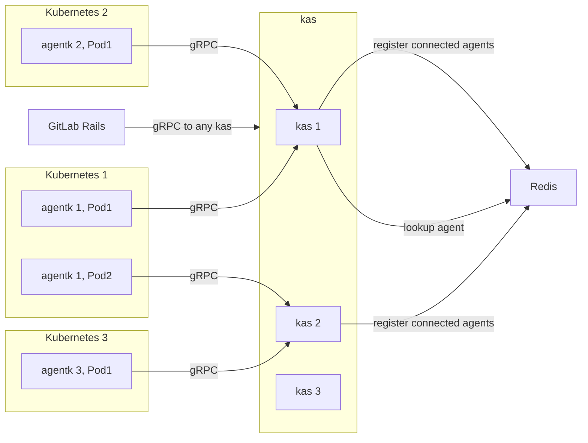
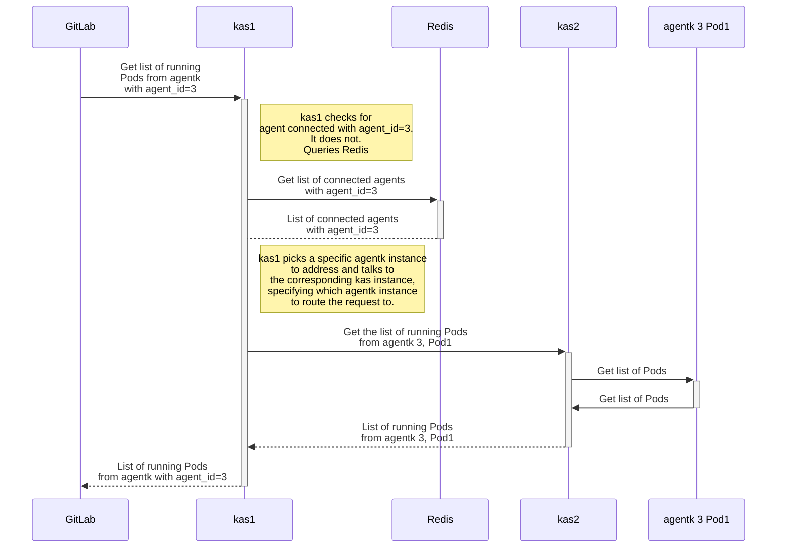
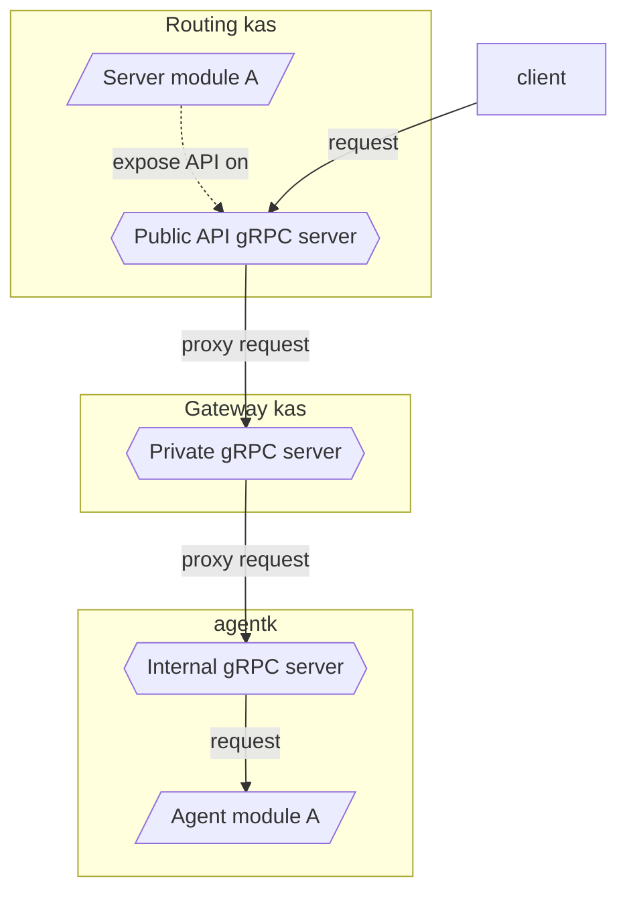
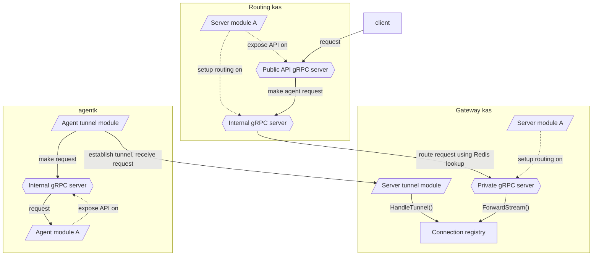

# Routing `kas` requests in the Kubernetes Agent

This document describes how `kas` routes requests to concrete `agentk` instances.
GitLab must talk to GitLab Kubernetes Agent Server (`kas`) to:

- Get information about connected agents. [Read more](https://gitlab.com/gitlab-org/gitlab/-/issues/249560).
- Interact with agents. [Read more](https://gitlab.com/gitlab-org/gitlab/-/issues/230571).
- Interact with Kubernetes clusters. [Read more](https://gitlab.com/gitlab-org/gitlab/-/issues/240918).

Each agent connects to an instance of `kas` and keeps an open connection. When
GitLab must talk to a particular agent, a `kas` instance connected to this agent must
be found, and the request routed to it.

## System design

For an architecture overview please see [architecture.md](../doc/architecture.md).

For this architecture, this diagram shows a request to `agentk 3, Pod1` for the list of pods:

Each `kas` instance tracks the agents connected to it in Redis. For each agent, it
stores a serialized protobuf object with information about the agent. When an agent
disconnects, `kas` removes all corresponding information from Redis. For both events,
`kas` publishes a notification to a Redis [pub-sub channel](https://redis.io/topics/pubsub).

Each agent, while logically a single entity, can have multiple replicas (multiple pods)
in a cluster. `kas` accommodates that and records per-replica (generally per-connection)
information. Each open `GetConfiguration()` streaming request is given
a unique identifier which, combined with agent ID, identifies an `agentk` instance.

gRPC can keep multiple TCP connections open for a single target host. `agentk` only
runs one `GetConfiguration()` streaming request. `kas` uses that connection, and
doesn't see idle TCP connections because they are handled by the gRPC framework.

Each `kas` instance provides information to Redis, so other `kas` instances can discover and access it.

Information is stored in Redis with an [expiration time](https://redis.io/commands/expire),
to expire information for `kas` instances that become unavailable. To prevent
information from expiring too quickly, `kas` periodically updates the expiration time
for valid entries. Before terminating, `kas` cleans up the information it adds into Redis.

When `kas` must atomically update multiple data structures in Redis, it uses
[transactions](https://redis.io/topics/transactions) to ensure data consistency.
Grouped data items must have the same expiration time.

In addition to the existing `agentk -> kas` gRPC endpoint, `kas` exposes two new,
separate gRPC endpoints for GitLab and for `kas -> kas` requests. Each endpoint
is a separate network listener, making it easier to control network access to endpoints
and allowing separate configuration for each endpoint.

Databases, like PostgreSQL, aren't used because the data is transient, with no need
to reliably persist it.

### `GitLab : kas` external endpoint

GitLab authenticates with `kas` using JWT and the same shared secret used by the
`kas -> GitLab` communication. The JWT issuer should be `gitlab` and the audience
should be `gitlab-kas`.

When accessed through this endpoint, `kas` plays the role of request router.

If a request from GitLab comes but no connected agent can handle it, `kas` blocks
and waits for a suitable agent to connect to it or to another `kas` instance. It
stops waiting when the client disconnects, or when some long timeout happens, such
as client timeout. `kas` is notified of new agent connections through a
[pub-sub channel](https://redis.io/topics/pubsub) to avoid frequent polling.
When a suitable agent connects, `kas` routes the request to it.

### `kas : kas` private endpoint

This endpoint is an implementation detail, a private API, and should not be used
by any other system. It's protected by JWT using a secret, shared among all `kas`
instances. No other system must have access to this secret.

When accessed through this endpoint, `kas` uses the request itself to determine
which `agentk` to send the request to. It prevents request cycles by only following
the instructions in the request, rather than doing discovery. It's the responsibility
of the `kas` receiving the request from the _external_ endpoint to retry and re-route
requests. This method ensures a single central component for each request can determine
how a request is routed, rather than distributing the decision across several `kas` instances.

### `kas` to `kas` to `agentk` routing

This section explains how the `kas`-> `kas` -> `agentk` gRPC request routing is implemented.

For a video overview of how some of the blocks map to code, see
[GitLab Kubernetes Agent reverse gRPC tunnel architecture and code overview
](https://www.youtube.com/watch?v=9pnQF76hyZc).

#### High level schema

Server side in this example:

1. `Server module A` exposes its API to get the `Pod` list on the `Public API gRPC server`.
1. When the public gRPC server receives the request, it determines the agent ID.
1. The public gRPC server calls the proxying code and forwards the request to a suitable `kas` instance.
1. The `kas` instance that has a suitable `agentk` proxies the request to that agent.

Agent side:

1. The `Agent module A` exposes the same API on the `Internal gRPC server` on the agent side.
1. When the internal gRPC server receives the request, it handles it (retrieves and returns the `Pod` list).

This schema describes how reverse tunneling is handled fully transparently
for both server and agent modules, so new features can be added easily:

#### Implementation schema

##### `kas` startup

1. `Server module A` sets up routing on the `Internal gRPC server` and on the `Private gRPC server`
   using `modserver.Config.RegisterAgentApi()`.
1. `Server module A` sets up request handler on the `Public API gRPC server`.
1. For each incoming tunnel connection `kas` calls `HandleTunnel()`. The method registers the tunnel and blocks,
   waiting for a request to proxy through the tunnel.

##### `agentk` startup

1. `Agent module A` sets up request handler on the `Internal gRPC server`.
1. Establish tunnels to `kas`.

##### Request handling

1. Request handler on the `Public API gRPC server`:

  1. Receives the request and determines the agent ID from it.
  1. Performs authentication and authorization as necessary.
  1. Makes a request to the `Internal gRPC server` and handles the response as if talking to an `agentk`.

1. Request handler on the `Internal gRPC server`:

  1. Receives the request from the `Public API gRPC server`.
  1. Gets agent ID from the request's metadata.
  1. Calls `GetTunnelsByAgentId()` to perform a Redis lookup to find a `kas` instance that has a connection from a suitable `agentk`.
  1. Once a found, the request is forwarded to that `kas` instance's `Private gRPC server`.

1. Request handler on the `Private gRPC server`:

  1. Blocks on `FindTunnel()` method of the `Connection registry`, waiting for a matching tunnel to proxy the
     connection through.
  1. `ForwardStream()` is called on the matching tunnel with the server-side interface of the incoming
     connection to proxy it through the tunnel.

### API definitions

- [`agent_tracker/agent_tracker.proto`](../internal/module/agent_tracker/agent_tracker.proto)
- [`agent_tracker/rpc/rpc.proto`](../internal/module/agent_tracker/rpc/rpc.proto)
- [`reverse_tunnel/rpc/rpc.proto`](../internal/module/reverse_tunnel/rpc/rpc.proto)
- [`cmd/kas/kasapp/kasapp.proto`](../cmd/kas/kasapp/kasapp.proto)
