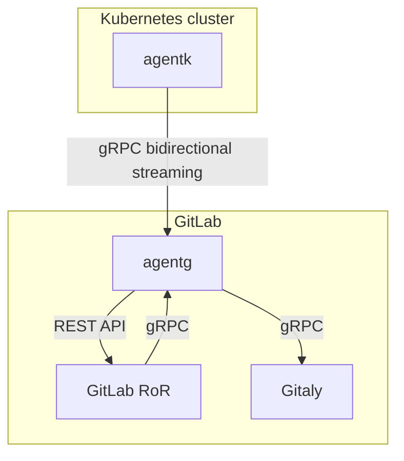

# gitlab-agent architecture

Today GitLab cannot integrate with clusters behind a firewall. If we put an agent into such clusters and another agent next to GitLab, we can overcome this limitation. See the scheme below.

* `agentk` is our agent. It keeps a connection established to a `agentg` instance. It waits for requests to process. It may also actively send information about things happening in the cluster.

* `agentg` is responsible for:
  * Accepting requests from `agentk`.
  * [Authentication of requests](identity_and_auth.md) from `agentk` by querying `GitLab RoR`.
  * Fetching agent's configuration from a corresponding Git repository by querying Gitaly.
  * Matching incoming requests from `GitLab RoR` with existing connections from the right `agentk`, forwarding requests to it and forwarding responses back.
  * (potentially) Sending notifications via ActionCable for events received from `agentk`.

* `GitLab RoR` is the main GitLab application. It uses gRPC to talk to `agentg`. We could also support Kubernetes API to simplify migration of existing code onto this architecture. Could support both, depending on the need.

[Bidirectional streaming](https://grpc.io/docs/guides/concepts/#bidirectional-streaming-rpc) is used between `agentk` and `agentg`. This allows the connection acceptor i.e. gRPC server `agentg` to act as a client, sending requests as gRPC replies. Inverting client-server relationship is needed because the connection has to be initiated from the inside of the Kubernetes cluster to bypass a firewall the cluster may be behind. See https://gitlab.com/gitlab-org/gitlab/-/issues/212810.
